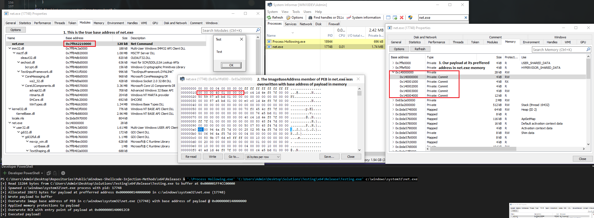

# Process Hollowing 1

Process hollowing is a technique which allows enables legitimate system process such as **ping.exe** to run malicious code. This has the benefit of appearing to be a normal signed process while actually running malicious code under the hood.

This implementation of process hollowing uses PEB manipulation & preffered payload address allocation. This avoids the need for image unmapping/re-mapping & base relocations which are memory operations that can trigger EDRs.

> [!IMPORTANT]
> You need to ensure your target & payload executables use the same subsystem. Running a console application in a GUI application will not work unless the code is modified.

## Steps
1. Read input payload from user to buffer in local process
2. Create target process in a suspended state
3. Allocate memory in the target process at the preffered base address of the executable. In x64 windows, this address is always 0x140000000 for .exe files.
4. Write the executable payload to the base address in target process.
5. Retrieve the base address of the PEB in the traget process to overwrite the ImageBaseAddress member with our payload. When a process is created in a suspended state, the PEB address is stored in RDX register in x64.
6. Apply the correct memory permissions for the executable image
7. Set RCX register to the address of the payloads entry point. RCX holds the processes entry point when its launched in a suspended state.
8. Resume the target process's main thread to run the payload

