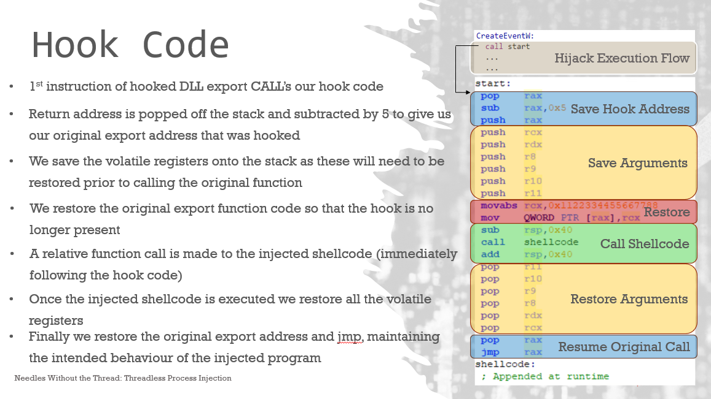

# Threadless Remote Process Injection via Function Hooking

> [!IMPORTANT]
> This source code is based on the threadless injection method described by [CCob](https://github.com/CCob) in the repository [ThreadlessInject](https://github.com/CCob/ThreadlessInject).

This shellcode injection method uses function hooking to execute shellcode in the address space of another process **_without_** creating a new thread. The shellcode is executed once the hooked function is called for the first time after initial installation of the hook. After execution, the hook is removed & the function is executed as though nothing happened. This allows the process to continue running along with our payload. Under the hood, a special loader shellcode handles saving the hooked functions parameters & restoring the hook prior to executing the main shellcode. After execution, the loader shellcode will restore the function parameters & resume execution of the unhooked function.

## Digging Deeper

### The Hook
The initial hook is a 5 byte trampoline patch placed at the start of the target function. This is a [call](https://www.felixcloutier.com/x86/call) operation which executes the shellcode loader.

The hook can be inserted within any function that has a memory hole within a 2GB range, up or down from the address of the target function. This limitation is due to the use of the call instruction with the hook, which expects a signed 32-bit function address. This means the call instruction can't acess anything beyond 2GB, up or down. For this reason, our shellcode loader & payload must be placed within a memory hole in this range.

To ensure our shellcode is placed within this range, we'll need to calculate a predefined memory range based on the address of the function. This differs from typical execution methods such as CreateThread which allows for allocation of the payload anywhere in memory.

#### Runtime Patching
Before patching the target function with the hook, we'll need to patch the trampoline itself with the offset of the base address of the payload. This provides the call instruction with the address to execute. 

### The Shellcode Loader
The shellcode loader acts as a wrapper for our main shellcode, which is appended to this loader in the memory hole. The loader is a core component which is responsible for the following:

1. Saving the arguments of the original function call
2. Restoring the original bytes of the function call (removing hook)
3. Executing the shellcode
4. Restoring the functions arguments & resuming execution

These operations provide stability to the target & ensure it keeps running properly while our payload is executed in the background. The slide below has been pulled from the original [Needles without the Thread](https://github.com/CCob/ThreadlessInject/blob/master/Needles%20without%20the%20Thread.pptx) powerpoint which describes the shellcode loader.

Click to show image

###### Slide 11 from Needles without the Thread

#### Runtime Patching
At runtime, we'll need to save the original bytes from the target function to this shellcode loader so it knows the original bytes required by the function when removing the hook. 

## Injection Procedure
This section describes the steps taken by the **threadless.c** program to execute shellcode locally using the threadless function hooking method.

1. Acquire a handle to the target process for injection.
2. Get the address of the target function to overwrite.
3. Find a memory hole within a 2GB range up or down from the target function call & allocate enough memory for the loader & main shellcode.
4. Copy first 8 bytes from target function to shellcode loader.
5. Copy offset of memory hole from target function to call operand in trampoline patch. Install the hook in the target function.
6. Write loader & shellcode to the memory hole. **Loader must be written first followed by the main shellcode**.
7. Wait for target process to execute hooked function call to trigger shellcode, remove hook & continue running normally.